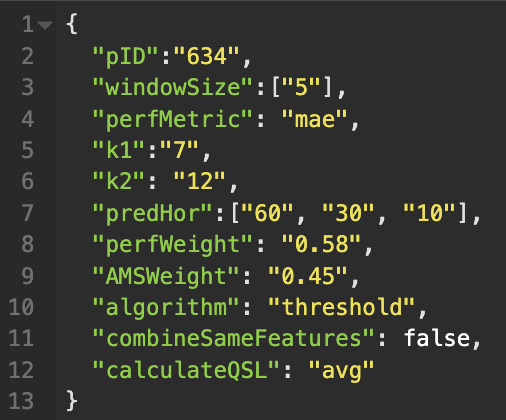
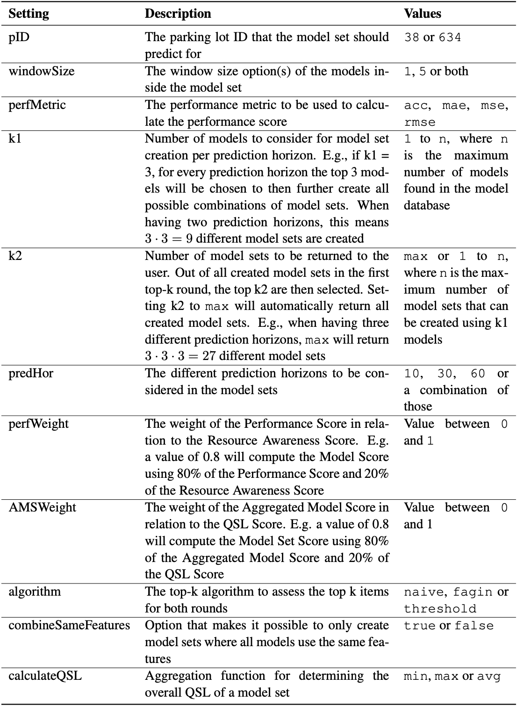
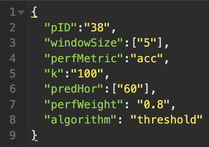

# 2023-MA-Niklas-Diller

Master's Thesis of Niklas Diller, M.A. CitH. at the Chair of Mobile Systems, University of Bamberg. 

The actual thesis can be accessed in `Thesis.pdf`.

The implementation for this master's thesis is split up into two modules: The pipelines for preprocessing and training, and the top-k retrieval system. This text will go into detail on how to successfully execute those modules and how to change the settings within them.  

## Preprocessing and Training Pipeline

To fill up a database with a large variety of machine learning models, both a preprocessing as well as a training pipeline were developed for this project. The pipelines are based on the work of the [model trainer implemented by Paul Pongratz and Alexandr Litvin](https://gitlab.rz.uni-bamberg.de/mobi/living-lab/parking/-/tree/draftWithPaulsCode?ref_type=heads). The idea is to first preprocess raw parking data in bulk based on chosen window sizes and parking lots. Once enough data has been preprocessed, a large number of different models can be automatically trained and stored, using the training pipeline.

### Getting started

- Make sure you are connected to the university network, either directly or via VPN.
- Open the files `preproccess.properties` and `training.properties` in `\bin\main\main\java`.
- In each file insert a valid URI to your database (`dbUri`), along with your username (`dbUsername`) and password (`dbPassword`). Have `rawTable` direct to the table containing the raw parking data (usually `Input_datasets_parkinglot_`), `preprocessedTable` to the table containing the preprocessed data, and `tableName` to the table you want to store the output of your pipeline in. Also, set a suitable `developer`name.
- Save the `properties`-files.

If you don't want to use any custom tables, you can use the tables that are preset in the `properties`-files. The pipelines' outputs are then stored in test databases. Just make sure you set up your Username and Password in this case.

Before starting the pipelines, it is useful to understand how to bring variety into the results each pipeline produces. The value changes that are happening for preprocessing or training are determined by adjusting Hash Maps that store the relevant data. These Hash Maps can be found in `ModelTrainer.java`. If one wants to train models for parking lot 38 and 634 the Hash Map `parkingLotMap` would look like this:

`this.parkingLotMap.put(0, 38);`

`this.parkingLotMap.put(1, 634);`

A special case is the Hash Naps for window sizes. Here, the actual window size and the corresponding `trainingWeeks` value(s) are combined in one Hash Map. Details can be read in the in-code documentation. 

### Preprocessing Pipeline

- Once, the `properties`-files are set up, the data that is to be preprocessed can be determined. For the preprocessing pipeline, the parking lot IDs and the window sizes can be set up, using `windowSizeMap`and `parkingLotMap` in the `ModelTrainer.java`file. 

### Training Pipeline

- Once, the `properties`-files are set up, the attributes of the models that are to be trained can be determined. For the training pipeline, the parking lot IDs, the prediction horizons, the window size, and the training data size in weeks can be set up using `parkingLotMap`, `predHorMap`and `windowSizeMap`. 

- The classifier algorithms and the features used for training can be controlled by (un)commenting lines of code in the main method. 

- In addition, one can choose to bring in a variation of the hyperparameters for kNN and RF classifiers, by changing the values in `kMap` and `maxDepthMap`. 

### Running Pipelines in Background

It is possible to run the presented pipelines in the background using the university's VM. This is especially useful if large quantities of data are to be preprocessed or a large amount of models is to be trained so the user does not have to rely on the SSH or VPN connection to be established at all times. First, connect to the VM using SSH and clone this git repository. 

To run the preprocessor pipeline, then set the variable `MainClassName` in the `build.grade` file to `main.java.Preprocessor`. Then, run the following commands:

`gradle clean build`

`nohup gradle run >preprocessor.log 2>&1 </dev/null &`

Adjust these steps accordingly, if you want to run the training pipeline instead.

## Top-K Retrieval System

To retrieve the best model(sets) from the models created from the training pipeline, the top-k retrieval system is used. The requests are sent via an RESTful API call and a Flask app then executes the top-k algorithm and returns the result to the client. The retrieval requests can be tailored to the user's liking in great detail. 

### Getting started

- Make sure you are connected to the university network, either directly or via VPN.
- Navigate to the directory `topkretrieval` and enter the virtual environment executing `source .venv/bin/activate`. 
- Start the Flask app using `flask run -port 8000`, or any other arbitrary port. 
- Open an API client of your choice (e.g. Insomnia) and reach the desired endpoint using the URL `http://127.0.0.1:8000` and one of the following:
	- **Model selection** ( `/api/select`): POST operation that retrieves information about a model that the user specifies via a JSON file.
	- **Model direct selection** (`/api/model/<model-name>`): READ operation, that retrieves information about a model the user specifies directly in the URL.
	- **Top-k single model** (`/api/topk`): CREATE operation that retrieves the k best models based on the users’ input.
	- **Top-k model set** (`/api/topk/modelsets`): CREATE operation that retrieves the k best model sets based on the users’ input.
	
The two Top-k API calls come with a number of settings that can be customized.

### Top-K Model Set

This POST request can be filled with several variables. 

The following table is extracted from the master's thesis and goes into detail for each choosable variable. 

### Top-K Single Model
 
The available settings for single-model retrieval are an abbreviated version of model set retrieval.

